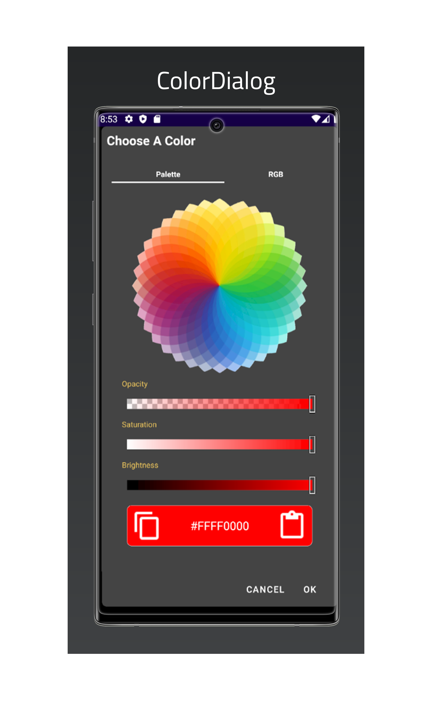
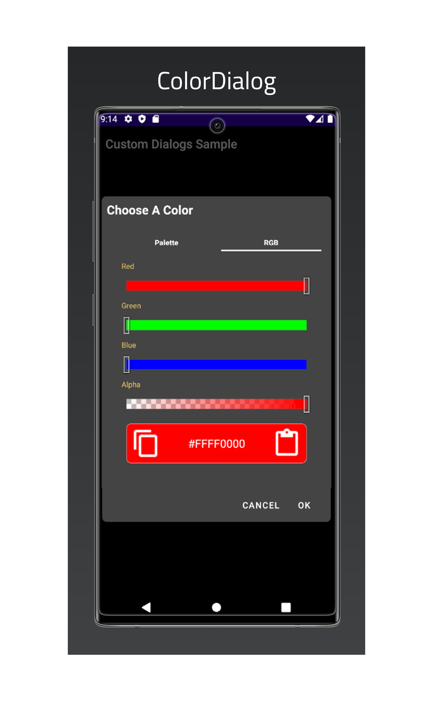

# Custom Dialogs
<p align=center> <b><i>Custom dialogs at your fingertips</i></b> </p>

[](https://github.com/TheRandomCrafter83/CustomDialogs) 

 

Custom Dialogs is an Android Library containing several useful custom dialogs.
- Added a BaseDialog for all other Dialogs to inherit from for cleaner code.
- Library contains the following custom dialogs:
    - ColorDialog: used to allow the user to choose a color. The selected color will be returned via the listener. (See Screenshots below)


## Features

- Set the dialog's background color
- Title
- Text color
- Margins
- An icon for the dialog

## Tech

Custom Dialogs is an open source project which can be found [Here](https://github.com/TheRandomCrafter83/CustomDialogs)
on GitHub.

## Installation
**IMPORTANT** This library requires the repository mavenCentral().

**build.gradle(App Module)** - then you can add the following in your module level's dependencies section. Replace '[build]' with build version located above.

```gradle
implementation 'io.github.therandomcrafter83:custom-dialogs:[build]' //<--add this implementation to the dependencies section
```

## Example Usage

```java
import androidx.appcompat.app.AppCompatActivity;

import android.graphics.Color;
import android.os.Bundle;
import android.view.View;
import android.widget.Button;

import com.coderz.f1.customdialogs.colordialog.ColorDialog;

public class MainActivity extends AppCompatActivity {

 @Override
 protected void onCreate(Bundle savedInstanceState) {
  super.onCreate(savedInstanceState);
  setContentView(R.layout.activity_main);
  Button button = findViewById(R.id.button);
  button.setOnClickListener(new View.OnClickListener() {
   @Override
   public void onClick(View v) {
    ColorDialog cd = new ColorDialog(MainActivity.this, new ColorDialog.DialogResponseListener() {
     @Override
     public void onOkClicked(int color) {
      button.setText(Integer.toString(color));
     }

     @Override
     public void onCancelClicked() {

     }
    });
    cd.setTitle("Choose a color");
    cd.setTabIndex(ColorDialog.TabIndex.PALETTE);
    cd.setInitialColor(Color.RED);
    cd.setMargins(8);
    cd.setBackgroundColor(Color.GRAY);
    cd.setTextColor(Color.YELLOW);
    cd.showDialog();
   }
  });
 }
}
```

## Screenshots
**ColorDialog**
<table>
  <tr>
    <td>Hue Palette</td>
     <td>RGB Sliders</td>
  </tr>
  <tr>
    <td valign="top"></td>
    <td valign="top"></td>
  </tr>
 </table>

## License
Copyright 2021 Carl Williams [TheRandomCrafter83]

Licensed to the Apache Software Foundation (ASF) under one or more contributor license agreements.  See the NOTICE file distributed with this work for additional information regarding copyright ownership.  The ASF licenses this file to you under the Apache License, Version 2.0 (the "License"); you may not use this file except in compliance with the License.  You may obtain a copy of the License at

[Apache-2.0 License ](http://www.apache.org/licenses/LICENSE-2.0)

Unless required by applicable law or agreed to in writing, software distributed under the License is distributed on an "AS IS" BASIS, WITHOUT WARRANTIES OR CONDITIONS OF ANY KIND, either express or implied.  See the License for the specific language governing permissions and limitations under the License.

